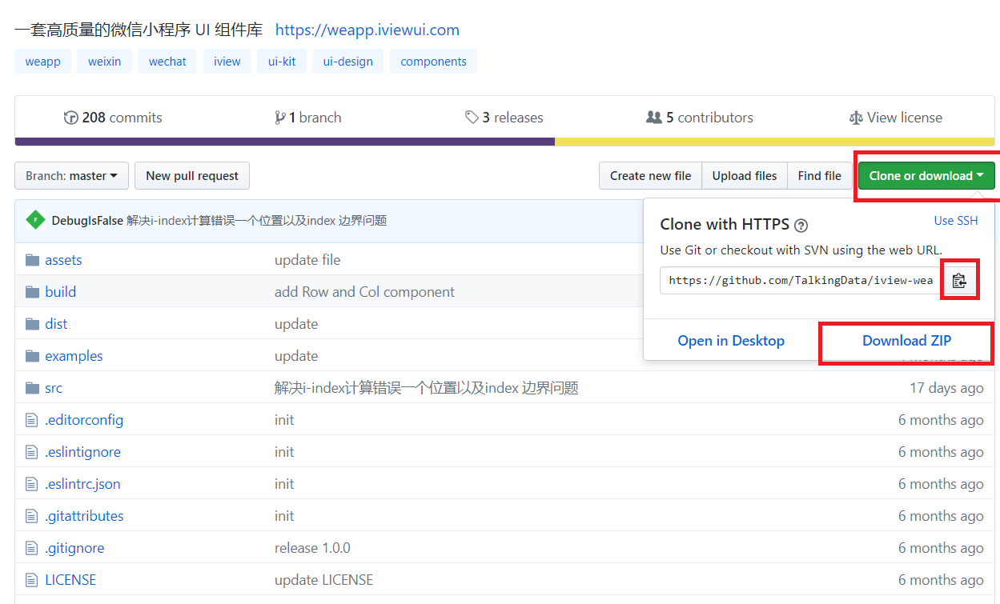

#### 写在前面 ###
#### 常规布局 ####
  盒模型是静态页面的一个核心概念。在一个前端页面里，元素通过标签的形式来书写，每一个标签便是一个盒子，从上至下依次排序，最终构成整个文档。这时就会产生一个问题，有时我们需要让两列元素并排展示，有时我们希望一个元素里均匀嵌套三个子元素，在传统的布局形式中，我们需要通过浮动(float)或行级块(inline-block)来达到效果。但实际应用时会出现各种问题，尤其在涉及均分或按比例等分的时候，更是十分麻烦。这时我们就可以使用一种全新的布局方式：flex布局
#### flex ####
  flex布局是一种弹性盒子理念。在flex布局中，盒子的长度或者宽度可以伸缩的。这就给布局带来了极大的便利。下面我们就通过几个常用属性来探究一下flex布局。给一个元素加上display: flex;样式，它就变成了一个弹性盒子。
#### flex-direction ####
  属性值
  - column
  - column-reverse
  - row
  - row-reverse
  弹性盒子有一个主轴和一个交叉轴，可以想象成是两个相互垂直的坐标轴。flex-direction属性设置的是主轴的方向。默认为row。如果我们想让一个盒子的内部元素从左到右呈一行排列，就可以使用flex-direction: row;样式，同理，如果我们希望一个元素的所有子元素按纵向排列，就一个使用flex-direction: column;样式
#### flex-grow ####
  所谓弹性盒子，当一个元素盒子在主轴方向上的长度/宽度之和不足以占满它的长度/宽度时，或没有指定子元素的长度/宽度值，子元素应按照一定的比例拉伸以填充满父级元素，每一个flex-grow属性就是一个比例，如果比例均为1，便是1:1等分。
#### justify-content ####
  属性值
  - flex-start：左对齐 （默认值）
  - flex-end：右对齐
  - center： 居中
  - space-between：两端对齐，项目之间的间隔都相等。
  - space-around：每个项目两侧的间隔相等。所以，项目之间的间隔比项目与边框的间隔大一倍。
  有时我们不希望子元素盒子占满整个父元素，而是希望它们按照一定的方式在主轴上排列，这就用到了justify-content属性，这个属性指定了盒子在主轴上的排列方式
#### align-items ####
  属性值
  - flex-start：交叉轴的起点对齐。
  - flex-end：交叉轴的终点对齐。
  - center：交叉轴的中点对齐。
  - baseline: 项目的第一行文字的基线对齐。
  - stretch：如果项目未设置高度或设为auto，将占满整个容器的高度。（默认值）
  同上面一样，元素在交叉轴上也应该有一个对齐方式，这个属性便是指定元素在交叉轴上的对齐方式的。
#### 代码示例 ####
  flex布局的具体用法如下，将父元素的`display`CSS属性设置为` flex`并添加`flex-direction`属性。 `flex-grow`属性添加给子元素。你还可以预览flex布局的效果
```
  .flex-column {
    width: 100px;
    height: 300px;
    background-color:aquamarine;
    display: flex;
    flex-direction: column;
  }
  .flex-column .item {
    flex-grow: 1;
    text-align: center;
    line-height: 98px;
    color: rgb(75, 150, 125) ;
    border: 1px solid rgb(75, 150, 125);
  }
  
```
```
  <div class="flex-column">
    <div class="item">1</div>
    <div class="item">2</div>
    <div class="item">3</div>
  </div>

```

#### 组件库 ####
[iView Weapp](https://weapp.iviewui.com/docs/guide/start)是一个十分好用的小程序组件库。它将一些常用页面结构和样式封装好行程一个个组件，在使用时我们只需要写一个标签，就能实现一些复杂的功能。我们可以通过下面这个小程序预览组件的效果


#### 快速开始 ####
[iView Weapp官方文档](https://weapp.iviewui.com/docs/guide/start)提供了快速开始的方案，我们在此基础上进行解读。
作为一个外部文件，我们首先要将组件库引入。进入IView的[Github](https://github.com/TalkingData/iview-weapp)页面，找到下载按钮。如果使用git命令下载，则点击复制链接地址，然后再本地运行git clone 命令下载。如果对git操作还不是很熟悉的话，可以下载zip文件然后解压。

下载好了之后，我们找到其中的`dist`文件夹，并将其复制到项目根目录下，就是`app.json`等文件所处的那个文件夹。在需要引用组件的页面的json文件里，我们添加这样一个属性
```
"usingComponents": {
    "i-button": "../../dist/button/index"
}
```
在这里，usingComponents属性告诉小程序当前页面要使用组件，`i-button`是一个自定义的名字，这里定义成什么，页面里就写什么标签。在它的后面便是引用组件的路径。我们下载了组件库并将dist文件夹复制了下来，组件文件肯定就在这里了。我们用相对路径的位置说明自己引用的组件在哪里，就可以使用了。
在wxml文件里，添加下面这样一个标签，就使用了组件库中的组件。标签名便是我们之前在json里面定义的`i-button`。
```
<i-button type="primary" bind:click="handleClick">这是一个按钮</i-button>
```

#### 那么就开始吧 ####
新建一个页面，在页面的wxml文件中填入以下代码
```
<i-tabs current="{{ current }}" color="#f759ab" bindchange="handleChange">
    <i-tab key="tab1" title="选项1"></i-tab>
    <i-tab key="tab2" title="选项2"></i-tab>
    <i-tab key="tab3" title="选项3"></i-tab>
</i-tabs>
```
页面的js文件中填入以下代码
```
Page({
  data: {
    current: 'tab1'
  },
  handleChange: function (e) {
    console.log(e)//打印事件源对象
    this.setData({
      current: e.detail.key
    })
  }
})
```
json文件写入以下代码
```
{
  "usingComponents": {
    "i-tabs": "../../dist/tabs/index",
    "i-tab": "../../dist/tab/index"
  }
}
```
这里我们需要读懂代码的含义了。首先在json文件的`usingComponents`属性中，我们定义了两个组件。分别是页面上部的导航栏和导航栏选项。然后我们在wxml中依照[官方文档](https://weapp.iviewui.com/components/tabs)的说明使用组件。最重要的就是理解js的部分
这个tabs组件通过一个名为current的数据绑定来确定当前选中的标签。`bindchange="handleChange"`这个属性意为绑定一个名为`handleChange`的函数，用于处理tab切换事件。在js文件就需要有一个handleChange函数。事件处理函数都会有一个事件源对象传入，就是代码中的e。通过打印我们可以发现，点击不用的选项，e.detail.key中的值会有所不同，所以我们通过setData来设置current的属性值为e.detail.key，从而实现了从逻辑层到视图层的数据传递。
效果图如下

官方文档给我们提供了大量的实例，我们可以一一尝试，找到最适合页面的组件。

#### 常见问题 ####
在效果没有按照预期出现时，不要不知所措。首先要把引用组件库到使用组件库的这一个过程理清楚，然后再分别考虑是哪一个环节出了问题。一开始我们要拷贝dist文件夹，那么拷贝到的地方是不是根目录呢，如果不是的话后面在使用组件库的时候就找不到这个组件了。在json里面声明的组件路径如果不正确也同样会出现相同的问题。其次json中声明的组件名称和wxml中使用的名称是否一致？最后，js里面绑定的函数和数据名是否一一对应？把这个过程理清楚，问题就能很快被我们发现。
